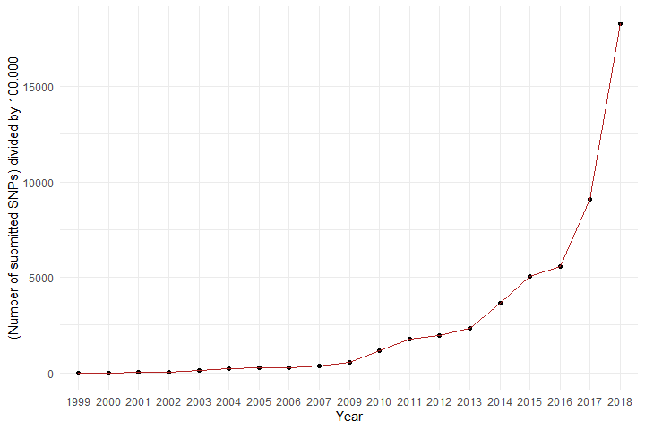
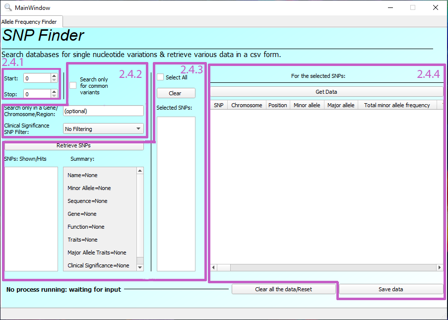
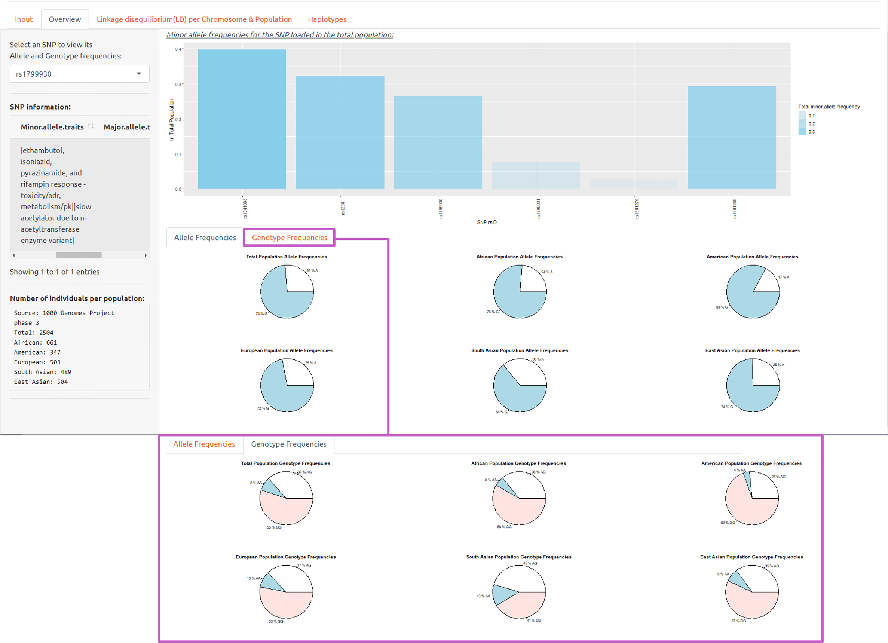
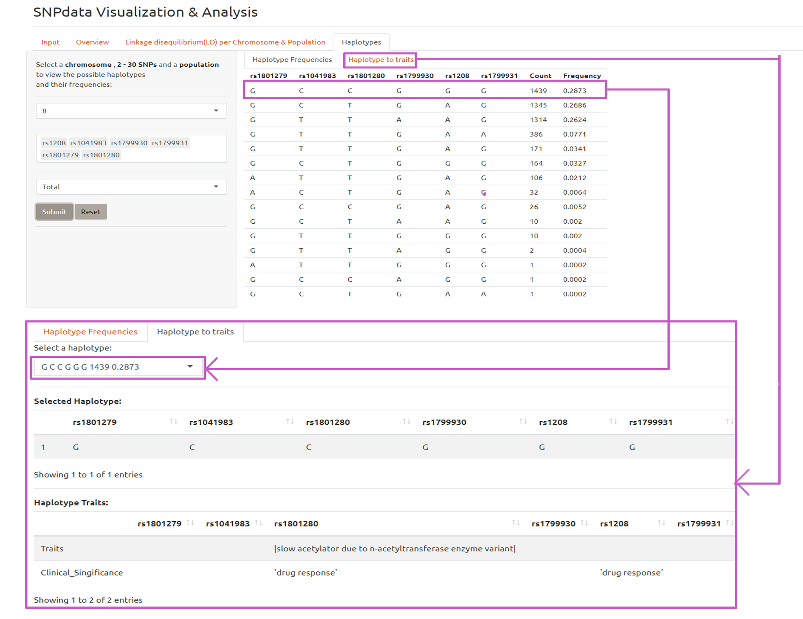

# Requirments/Launch

### Required external libraries/frameworks for SNPfinder.py

```
$pip install PyQt5
$pip install requests
$pip install pandas
```

### Required external packages for SNPanalysis.R

```
install.packages("shiny")
install.packages("bslib")
install.packages("tidyverse")
install.packages("LDlinkR")
install.packages("heatmaply")
install.packages("shinycssloaders")
install.packages("reactlog") 
install.packages("devtools") 
```
The open-source RStudio IDE is also required. It can be downloaded from [here](https://www.rstudio.com/products/rstudio/download/#download).

### Working with SNPop
1. Open a terminal in the folder containing Snpfinder.py and run: ```python Snpfinder.py ```
2. Procced with the workflow in the GUI of SNPfinder, as explained in detail in the SNPfinder section and save the produced csv.
3. At this point you can cLose SNPfinder.py if you wish.
4. Open SNPanalysis.R using RStudio and click on the "Run app" icon , alternatively press CTRL+SHIFT+ENTER.
5. Load the csv produced from SNPfinder in SNPanalysis Input tab using the GUI file handler.
6. Your data is loaded, procced with the analysis and visualization workflow of SNPanalysis detailed in the Snpanalysis section.

# Brief Introduction
The constant improvement of high throughput sequencing technologies (HTS), as well as the steep decline of their cost, has resulted in a data “revolution” in the field of genomics. Of these data, a big part is Single Nucleotide Polymorphisms (SNPs) data, which entail 99\% of human genetic variation. For example, DbSNP, the most popular  database for single nucleotide variants, micro-satellites, and small-scale insertions and deletions,doubled its data size from  *557,939,960* submissions to *907,237,763* between 2016-2017 and then again from *907,237,763* to *1,828,331,768* from 2017 to 2018 as its shown in the figure below. In 2021 DbSNP has *3,341,554,567* submissions. The evident acute growth in the amount of data available on human genetic variation as well as variation in other species classified genomics as a "big data" field and sparked the interest for the development of SNPop.
<p align="center">
  <br>
  data source: https://www.ncbi.nlm.nih.gov/projects/SNP/snp_summary.cgi
</p>

# SNPop
Is an application package for the collection, visualization and small scale analysis of annotated data regarding single nucleotide polymorphisms across populations.
SNPop contains two user-friendly GUI software: SNPfinder written in python and SNPanalysis written in R. 

**Important:** SNPanalysis utilizies the LDlinkR package, hence it requires a private user token to function. If you wish to use SNPanalysis replace the string: 'user_token' in the code, with a token retrieved from: https://ldlink.nci.nih.gov/?tab=apiaccess.

### Data-set :
The data source selected for the algorithm is the secondary SNP data set of which the 1000 Genomes project provides a population frequency in dbSNP. This data set was chosen since the 1000 Genomes Project provides additional data for specific populations, as well as phased genotypes in other databases. 

### Algorithm: 
The data flow/logic of SNPop is showcased in the following figure:
<p align="center">
  
</p>

1. Various SNP data types are mined from databases using the Ensembl Rest API and  NCBI's The Entrez Programming Utilities (E-utilities).
2. API/User interaction is handled by SNPfinder via the use of GUI elements and the retrieved data are processed and saved in a single csv file.
3. The csv file is imported in SNPanalysis where the user can  visualize and analyze Linkage Disequilibrium , Haplotype and Allele frequency SNP data, along with their traits across populations.

# SNPfinder.py
<p align="center">
  
</p>

As mentioned in the previous section SNPfinder handles the interactions between the user and the implementdatabase API's. 
- GUI elements 2.4.1 allow the user to set a numeric search window for their SNP query. 
- GUI elements 2.4.2 behave as filters for the SNP query. The user can search SNPs with any combination of SNP genetic region, clinical significance and >1% minor allele frequency in the population.
- GUI elements 2.4.3 are implemented to showcase the retrieved SNPs and provide a summary of SNP data helping the user choose the SNPs for which to obtain further data.
- GUI elements 2.4.4 present the user with further data for the selected SNPs and allow saving in a single csv file. 

### Example search
An example search of SNPs on the gene NAT2 responsible for variations in drug response will be as follows:
The user defines the clinical significance filter of SNPs as drug response, the DNA region filter to the NAT2 gene and because the exact number of SNPs is unknown they input the max number (100) in the search window. 
<p align="center">
  
</p>
 The full Csv results for this example search is available as "example.csv"

# SNPanalysis.R
Four GUI tab elements were implemented in SNPanalysis, with UI and server components, creating a SNP population data, visualization and analysis workflow. Since each tab covers a part of the workflow they are detailed in order. 

### Input tab 
To import the file a GUI tab named 'Input' was created. The tab contains a file input GUI element  and a data table  to display the imported CSV. When the user uploads the file, the server-side of the file input element stores it in a variable. This variable is then inserted and displayed using the data table.
<p align="center">
  
</p>

### Overview tab 
The overview tab provides a bar chart, where each bar represents the frequency of each imported SNP in the total population. Additionally, for each selected SNP population-specific allele and genotype frequencies are provided in pie charts, as well as phenotype and function data extracted from the CSV in a data-table.
<p align="center">
  
</p>

### Linkage disequilibrium tab
LD tab delivers matrices of the D' and r squared pairwise calculations for the imported SNPs, as well as the graphical representation of these matrices as heatmaps in the corresponding sub-tabs.  The LD population heatmaps produced by the pairwise calculations of rs1208, rs1041983, rs1799930, rs1799931, rs1801279 and rs1801280 for the African Population are displayed below as an example. A gradient palette of purple = 0 to yellow = 1, is used to map the retrieved values. Furthermore, white squares correspond to unavailable LD data for the SNP pair in the corresponding population.

- **r squared LD heatmap**
<p align="center">
  
</p>


- **D' LD heatmap**
<p align="center">
  
</p>


###Haplotypes tab

The haplotypes tab provides the frequencies of the imported SNPs haplotypes per population and the association of these haplotypes with phenotypes.
<p align="center">
  
</p>

# Final SNP data pipeline
Considering the previous sections the data pipeline SNPop produces is showcased in the following figure:
<p align="center">
  
</p>

# Limitations and recommendations
- Limitations: SNPop is limited by data available in databases, this results in possible omitted SNPs and/or traits. Consequently, while SNPop can paint an accurate picture for the phenotype associated with a haplotype across populations. It's results shouldn't be taken for granted but as a direction for the user's further research on the topic.
- Recommendation: An addition that would greatly increase SNPpop functionality is the inclusion of the option to select specific sub-populations for each main population. This can be achieved by modifying the code of the data collection API functions in SNPfinder as well as the LDlinkR functions in SNPanalysis.
